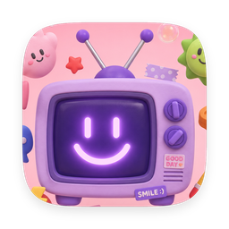

<p align="center">
  
</p>

<h1 align="center">Aftermeet</h1>

<p align="center">开完会，事情自动往前走。</p>
<p align="center">本地实时转写 · AI 生成式纪要 · 待办落成飞书任务 · 会前自动追问</p>

<p align="center">
  <a href="https://github.com/mhplala/aftermeet/releases/latest"></a>
  <a href="https://github.com/mhplala/aftermeet/releases"></a>
  
  <a href="LICENSE"></a>
</p>

## 它做什么

会议软件负责开会，Aftermeet 负责会后的一切：

- **会中本地实时转写**——ScreenCaptureKit 采集系统音频与麦克风，whisper.cpp 端上推理。音频不出网，逐字稿边转边落盘，崩溃最多丢几秒
- **AI 生成式纪要**——模型按每场会的内容自选积木排版：摘要、关键数字、方向转变、深度要点、决策、分歧、时间线、原话、下次议题
- **待办一键落成飞书任务**——确认即建卡、通知负责人；姓名只做精确唯一匹配，宁可待认领不派错人
- **飞书日历交叉比对**——按录音时间戳自动命名会议；日历里同主题会议再次出现时，自动生成上次待办的进度追问卡
- **全文检索**——SQLite FTS5 索引标题、摘要与逐字稿，⌘K 直达
- **每日综述与周报**——按天汇总所有会议；周报台账一键复制 Markdown
- **纪要问答**——只依据这场会的逐字稿回答，没提到就明说，不编造

## 下载

从 [Releases](https://github.com/mhplala/aftermeet/releases/latest) 下载 DMG，拖入「应用程序」即可。已通过 Apple 公证。

首次录制会请求两项系统权限：屏幕录制（采集系统音频）与麦克风（收录你的发言）。

## 依赖

转写引擎（[whisper.cpp](https://github.com/ggerganov/whisper.cpp)）已内置，无需安装。

| 依赖 | 用途 | 获取 |
|---|---|---|
| 转写模型 | ggml 格式，首次使用下载一次 | 设置 → 转写模型（推荐 Medium Q5） |
| [lark-cli](https://github.com/larksuite) | 飞书链路：任务 / 日历 / 同步（可选） | 装好并登录后自动接入 |

不装 lark-cli 也能用：本地转写、纪要、待办、检索全部可用，只是没有飞书侧的任务回写与日历比对。

## 工作原理

```
会议软件（任意）
    │  系统音频 + 麦克风（ScreenCaptureKit，本机采集）
    ▼
whisper.cpp 常驻推理（端上，音频不出网）
    │  逐字稿实时落盘
    ▼
LLM 生成式提炼 ──► 纪要积木 + 待办（低置信度 → 待认领）
    │                        │
    ▼                        ▼
SQLite + FTS5           飞书任务 / 群转发（lark-cli，用户身份）
    ▲
    └── 飞书日历 / 妙记纪要 定时同步、时间戳交叉比对
```

## 隐私

- 会议音频与逐字稿只在本机处理和存储，不上传
- 纪要提炼与问答将**文本**发送至内置的 AI 服务（按设备限额），或你在设置中配置的自有 API（BYOK，Key 存系统钥匙串）；逐字稿原文之外不携带任何账号信息
- 飞书操作全部通过本机 lark-cli 以你的身份执行，应用不保存任何凭证
- 录制对其他参会者不可见，是否告知由你决定——请遵守所在地法律与公司规定

## 从源码构建

```bash
brew install xcodegen cmake
git clone https://github.com/mhplala/aftermeet.git && cd aftermeet
./scripts/vendor-whisper.sh     # 静态编译内置转写引擎（一次即可）
./build.sh
open .build/Build/Products/Debug/AfterMeet.app
```

要求 Xcode 26 / macOS 14+（麦克风采集需 macOS 15+）。`./release.sh <version>` 产出签名公证的 DMG（需自备 Developer ID）。

## License

[MIT](LICENSE) © Stev Wang
